# Data Lakehouse - Movilidad Publica Santiago


Proyecto de Data Engineering aplicado a movilidad urbana de Santiago (DTPM): arquitectura end-to-end, decisiones de modelado, calidad de datos y serving analitico para uso operativo.

## Resumen profesional (Data Engineer)

### Que disene
- Arquitectura de datos completa Bronze -> Silver -> Gold para movilidad urbana a gran escala.
- Capa Silver orientada a calidad con quarantine, contratos y validaciones automatizadas.
- Modelo dimensional Kimball con SCD2 para preservar historia y trazabilidad.
- Capa de serving analitico con API y portal de consultas geoespacial.

### Que decisiones tecnicas tome
- DuckDB + Parquet como motor de transformacion para alto volumen sin cluster.
- Estrategia all-VARCHAR + TRY_CAST para robustez frente a datos sucios de origen.
- Separacion explicita de datos validos vs invalidos para proteger analitica de negocio.
- Diseno de claves/granos e idempotencia para cargas confiables y repetibles.

### Que resultado logre
- 50,508,171 registros procesados con pipeline reproducible y auditable.
- 3,605,891 filas en `fct_trip` y 14,423,564 en `fct_trip_leg`.
- Reduccion de columnas en viajes de 101 a 21 para consumo analitico eficiente.
- 22/22 smoke tests pasando en la capa Silver.

## Demo (vista real del producto)

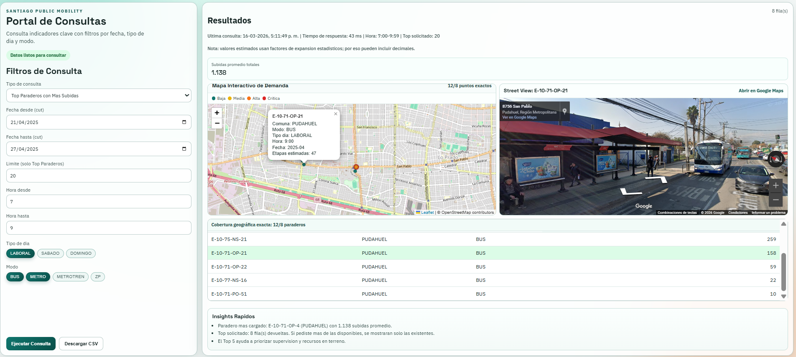

## Perfil tecnico del proyecto (Data Engineer)
- Diseno e implementacion de arquitectura Medallion para volumen real (50.5M+ registros).
- Definicion de contratos de calidad, quarantine y validacion automatizada en Silver.
- Modelado dimensional Kimball con SCD2 para mantener historia y consistencia analitica.
- Construccion de capa de serving: API de consultas + portal BI geoespacial.
- Operacion reproducible con Docker en modo demo y en modo datos reales.

## Decisiones de arquitectura y por que importan
- DuckDB sobre Parquet: procesamiento columnar eficiente sin cluster dedicado.
- All-VARCHAR + TRY_CAST en Silver: evita fallos silenciosos y mejora auditabilidad.
- Quarantine separado de datos validos: protege analitica de ruido operacional.
- SCD2 en dimensiones criticas: trazabilidad temporal real para analisis historico.
- API desacoplada de pipeline: permite evolucionar hacia producto de decisiones.

## Resultados

| Metrica | Valor |
|---------|-------|
| Registros procesados | **50,508,171** filas |
| Volumen raw | **~15.9 GB** |
| Datasets integrados | 3 (viajes, etapas, subidas_30m) |
| `fct_trip` cargadas | **3,605,891** filas |
| `fct_trip_leg` cargadas | **14,423,564** filas |
| Tasa de datos invalidos | < 0.2% |
| Reduccion de columnas (viajes) | 101 -> 21 cols |
| Smoke tests pasando | 22/22 |
| Periodo cubierto | Semana 21-27 abril 2025 |

---

## Arquitectura Medallion

<div align="center">
  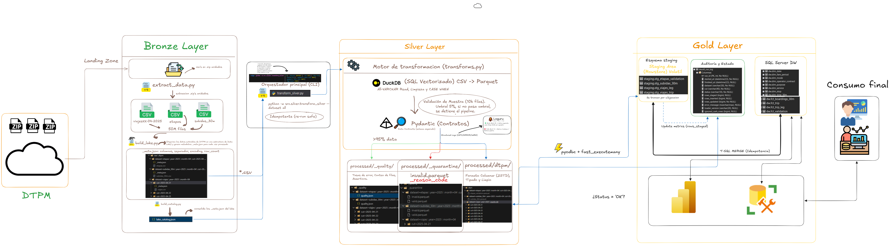
  <p><i>Pipeline tecnico completo: ingesta, calidad, transformacion y modelo dimensional.</i></p>
</div>

<div align="center">
  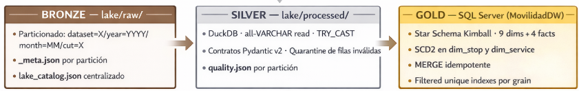
  <p><i>Separacion de responsabilidades por capas Bronze, Silver y Gold.</i></p>
</div>

---

## Modelo Dimensional

> Documentacion detallada del modelo: [docs/README.md](docs/README.md)


### Data Marts

El DW se organiza en 4 data marts con dimensiones conformadas.

1. Trips and OD - demanda y movilidad origen-destino

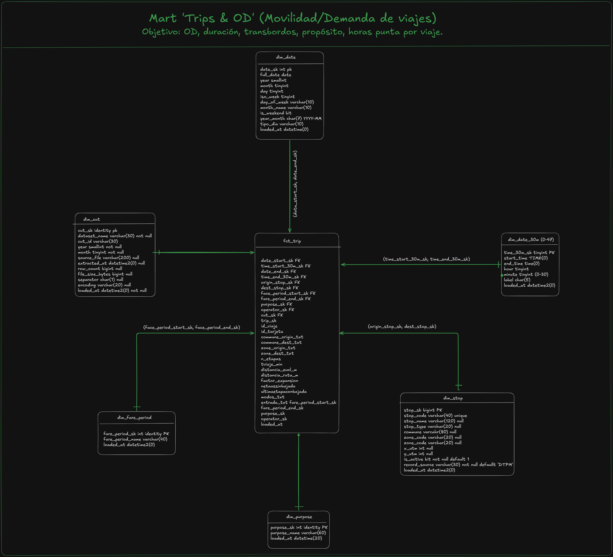

2. Trip Legs - etapas del viaje y transbordos

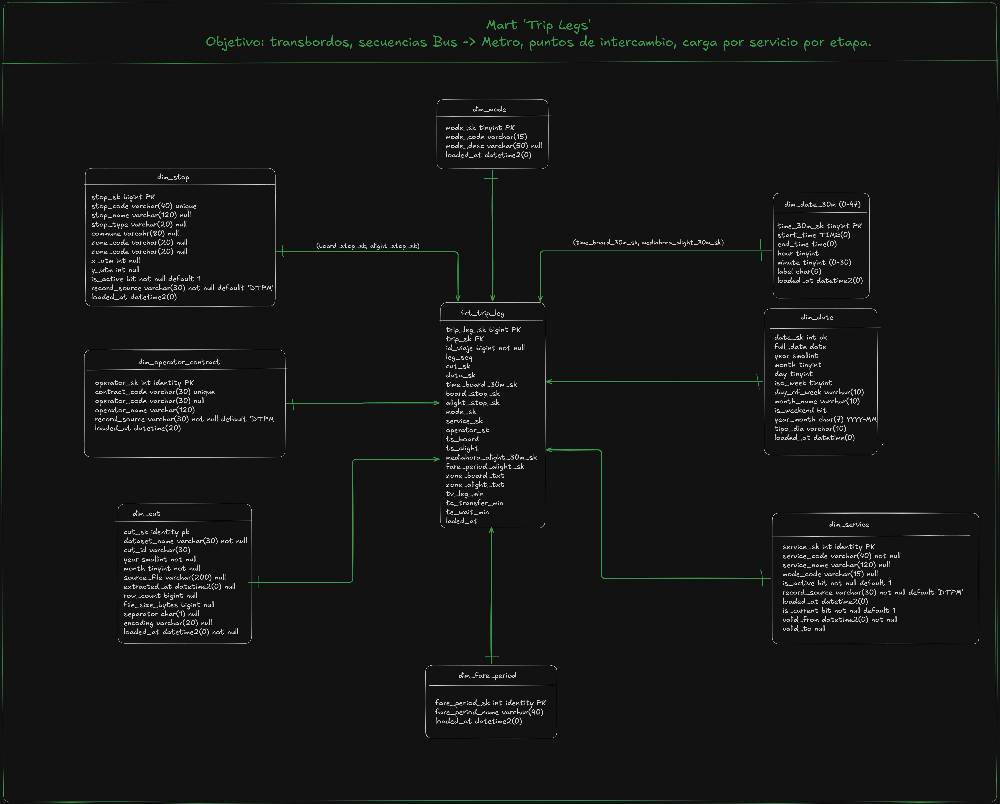

3. Stages and Operations - operacion por validacion

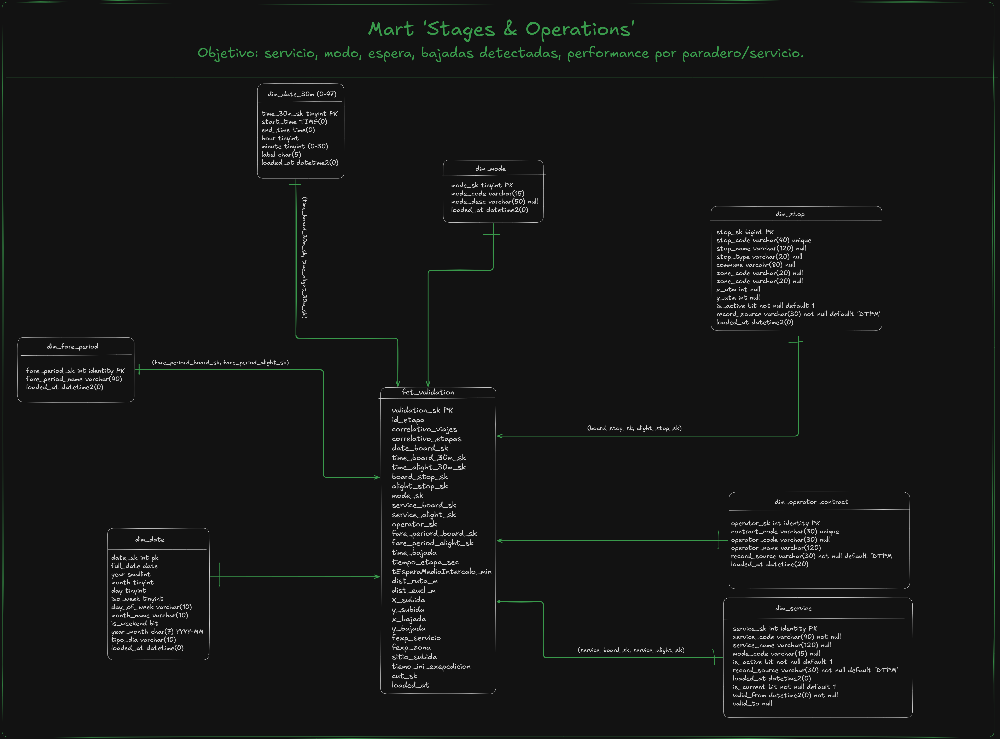

4. Network Demand - demanda agregada por paradero y franja

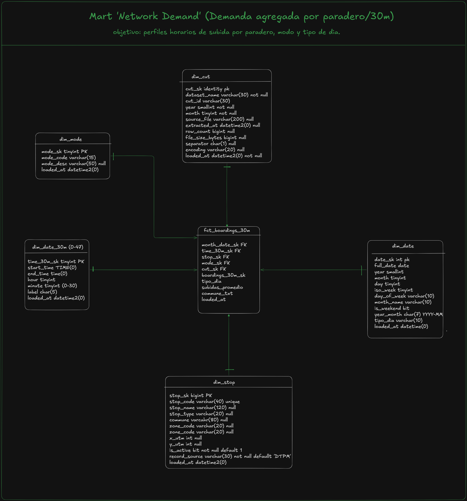

---

## Analitica Ejecutiva (Power BI)

### Pagina 1 - Resumen Ejecutivo

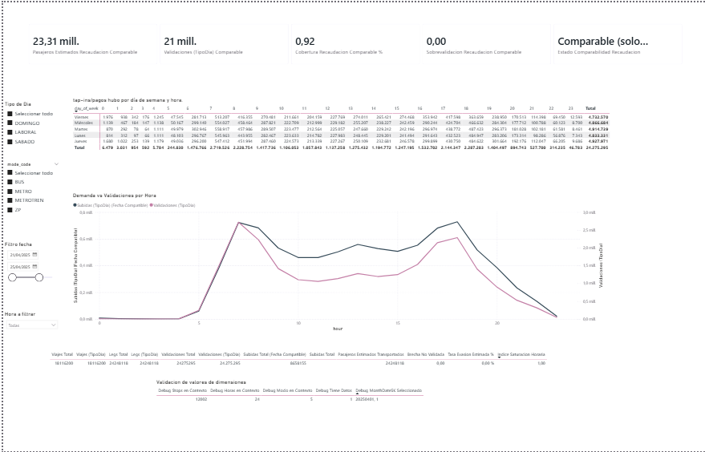

### Pagina 2 - Oportunidades Estrategicas

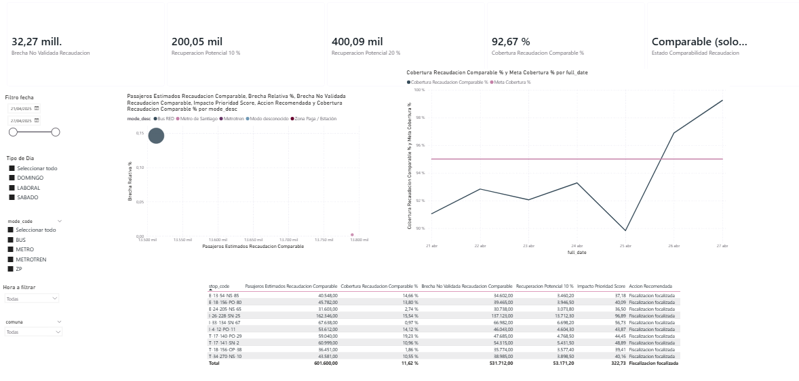

### Vistas tecnicas y de validacion

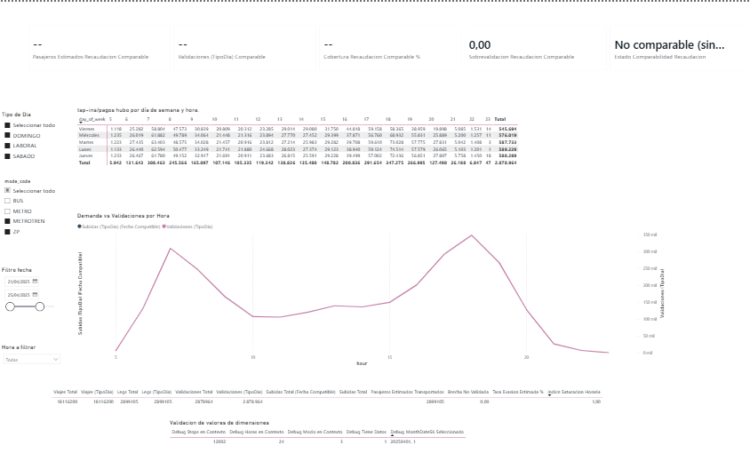

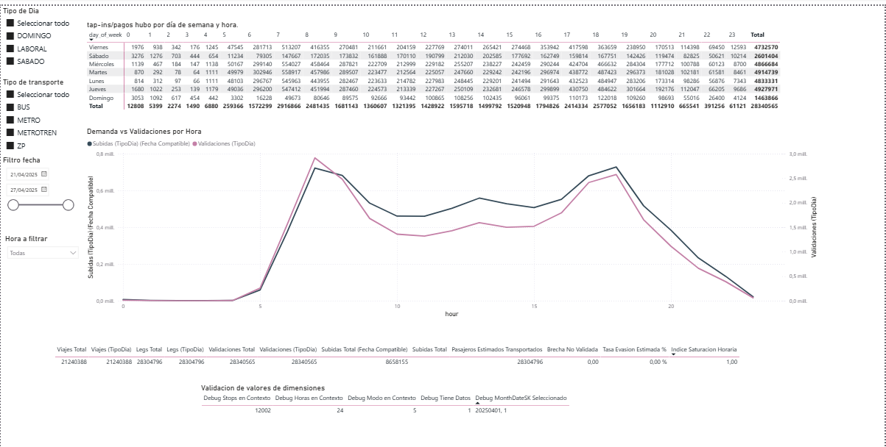

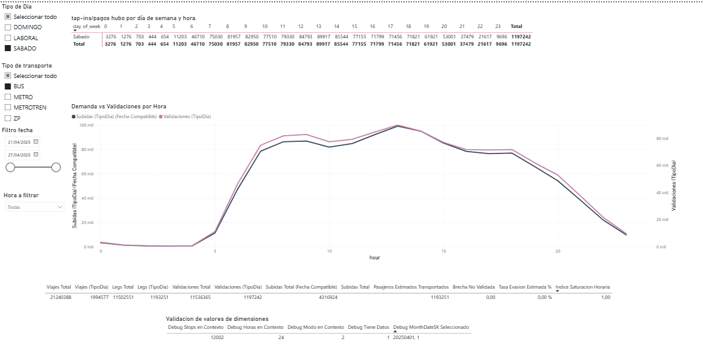

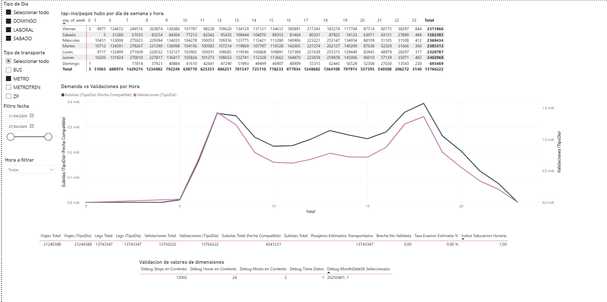

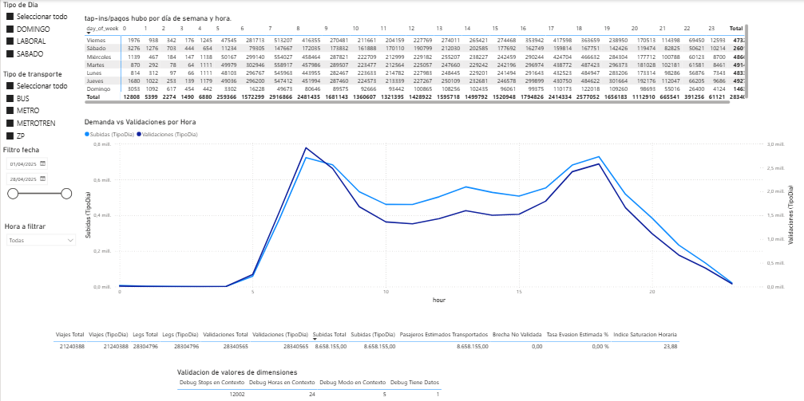


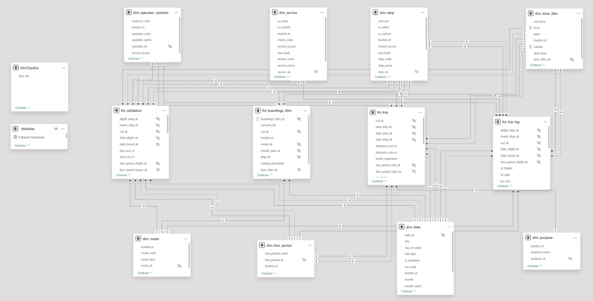

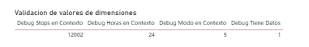

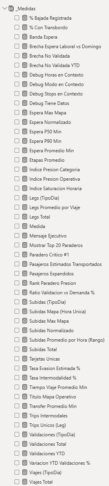

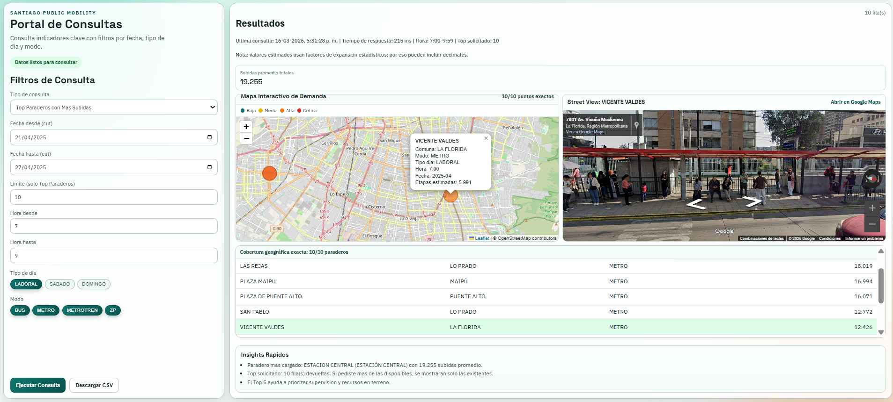


### KPI validados con SQL (corte 2025-04-21 a 2025-04-27)

Universo comparable: BUS y METRO.

| Indicador | Valor |
|---------|-------|
| Pasajeros estimados comparables | **27,303,047** |
| Validaciones comparables | **25,302,587** |
| Cobertura recaudacion comparable | **92.67%** |
| Brecha no validada comparable | **2,000,460** |
| Sobrevalidacion comparable | **0** |

### Documentacion funcional y tecnica de BI

- [docs/powerbi/PAGINA_01_POWERBI_RESUMEN_EJECUTIVO.md](docs/powerbi/PAGINA_01_POWERBI_RESUMEN_EJECUTIVO.md)
- [docs/powerbi/PAGINA_02_OPORTUNIDADES_ESTRATEGICAS.md](docs/powerbi/PAGINA_02_OPORTUNIDADES_ESTRATEGICAS.md)
- [docs/powerbi/SOLUCION_PROBLEMA_COBERTURA_RECAUDACION.md](docs/powerbi/SOLUCION_PROBLEMA_COBERTURA_RECAUDACION.md)
- [docs/powerbi/DAX_ENTERPRISE_MEDIDAS.md](docs/powerbi/DAX_ENTERPRISE_MEDIDAS.md)

---

## Preguntas de negocio que responde el DW

- Cuales son los periodos de mayor demanda por modo de transporte.
- Que flujos origen-destino concentran mas viajes.
- Cuantos transbordos promedio realiza un usuario segun la hora.
- Cual es el tiempo promedio de espera por servicio y territorio.
- Que paraderos concentran mayor carga en hora punta.
- Como varia el proposito de viaje por zona de la ciudad.
- Que servicios presentan mayor tasa de bajada no registrada.

---

## Ejecucion con Docker (paso a paso)

### A) Portal con datos reales (no demo) - recomendado
Usa tu `lake/processed` ya construido, sin regenerar demo.

```bash
docker compose -f docker-compose.web.full.yml up --build -d
```

Abrir:
- Portal: http://localhost:8001
- API docs: http://localhost:8001/docs
- Health: http://localhost:8001/api/health

Detener:

```bash
docker compose -f docker-compose.web.full.yml down
```

### B) Portal demo (muestra pequena)

```bash
docker compose -f docker-compose.web.yml up --build -d
```

Abrir:
- Portal: http://localhost:8000
- API docs: http://localhost:8000/docs

Detener:

```bash
docker compose -f docker-compose.web.yml down
```

### C) Solo pipeline demo (sin UI)

```bash
docker compose -f docker-compose.demo.yml up --build
```

---

## Endpoints principales
- `GET /api/health`
- `POST /api/query`
- `POST /api/map_points`

---

## Stack tecnico

| Categoria | Herramienta | Uso |
|-----------|-------------|-----|
| Lenguaje | Python 3.11 | ETL, calidad, API |
| Procesamiento | DuckDB | Transformacion Silver sobre Parquet |
| Contratos | Pydantic v2 | Validacion de muestra |
| Backend web | FastAPI + Uvicorn | Query API |
| DW principal | SQL Server | Modelo dimensional Kimball |
| DW portable | SQLite | Version ligera para analitica local |
| Frontend | HTML/CSS/JS + Leaflet | Portal de consultas BI |
| Contenedores | Docker Compose | Ejecucion reproducible |

---

## Donde mirar codigo clave
- `src/silver/transforms.py` -> transformaciones + quality/quarantine.
- `src/silver/contracts.py` -> contratos Pydantic de la capa Silver.
- `src/gold/load_gold.py` -> carga Gold, dimensiones, facts y SCD2.
- `src/sqlite/load_sqlite.py` -> carga portable a SQLite.
- `src/webapp/query_service.py` -> consultas de negocio y geoespacial.
- `web/static/app.js` -> UX del portal y comportamiento de mapa.

---

## Documentacion del proyecto
- [docs/ARQUITECTURA_MEDALLION.md](docs/ARQUITECTURA_MEDALLION.md)
- [docs/DIA_1_BRONZE_Y_PYTHON.md](docs/DIA_1_BRONZE_Y_PYTHON.md)
- [docs/DIA_2_SILVER_Y_CALIDAD.md](docs/DIA_2_SILVER_Y_CALIDAD.md)
- [docs/DIA_3_GOLD_Y_KIMBALL.md](docs/DIA_3_GOLD_Y_KIMBALL.md)
- [docs/silver_layer_decisions.md](docs/silver_layer_decisions.md)
- [docs/DOCKER_DEMO.md](docs/DOCKER_DEMO.md)
- [docs/ESCALAMIENTO_PRODUCTO_FUNCIONAL.md](docs/ESCALAMIENTO_PRODUCTO_FUNCIONAL.md)

---

Datos abiertos del DTPM - Directorio de Transporte Publico Metropolitano de Santiago.
